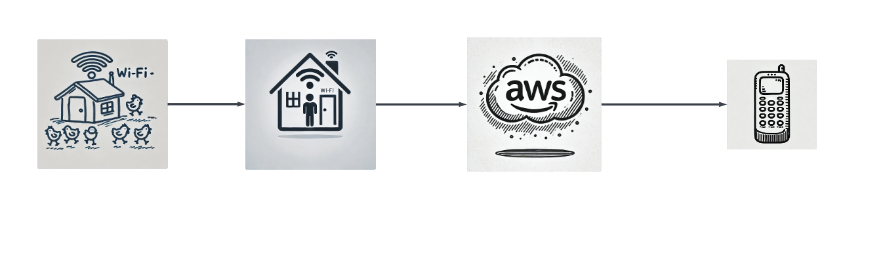
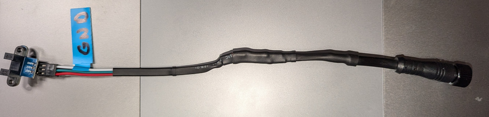
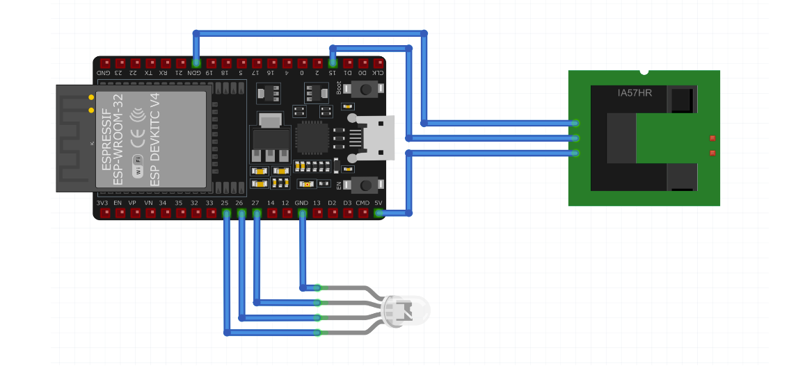

# Chicken Coop Door Sensor Documentation

## 1. Introduction

### Overview of the System

The chicken coop door sensor system is designed to monitor the status of a chicken coop door, ensuring it is securely
closed at night and open during the day. This system uses a passive sensor setup involving an ESP32 controller and an
infrared slotted optical optocoupler to detect the door's position. It communicates the door status via text messages
and a visual LED indicator.

### Purpose and Benefits

The primary purpose of this system is to enhance the safety and security of chickens by ensuring the coop door is
properly managed without modifying the door mechanism or the chickens themselves. The benefits of this system include:

- Real-time notifications of door status through text messages.
- Visual indication of door status via an LED light, providing immediate feedback.
- Automated monitoring and alerts to prevent door closure or opening failures.
- Minimal intervention required for installation and maintenance.

  

### System Components

The system comprises several key components:

- **ESP32 Controller:** Acts as the central processing unit, reading sensor data and sending status messages.
  

- **Infrared Slotted Optical Optocoupler:** Detects the open or closed state of the chicken coop door.
  

- **10mm LED Bulb:** Provides a visual indication of the door status (red for open, green for closed).
  

- **Amazon Web Services (AWS):** Handles the logic and text messaging for status notifications.

## 2. System Requirements

### Hardware Requirements

- ESP32 (controller)
- Infrared slotted optical optocoupler (sensor)
- 10mm LED bulb
- Power supply for the ESP32 and LED

### Software Requirements

- Micropython firmware for ESP32
- AWS account with access to API Gateway, Lambda functions, CloudWatch, and SNS (Simple Notification Service)
- Code editor for writing and uploading code to the ESP32

### AWS Account Setup

- Create an AWS account if you don’t have one.
- Set up the required services: API Gateway, Lambda, CloudWatch, and SNS.
- Configure necessary permissions and roles for the Lambda functions.

## 3. Parts List

### Main Components

- **[ESP32-WROOM-32D Microcontroller](https://a.co/d/9vEc9dk)**
    - Specifications
        - **Processor**: Dual-core Xtensa® 32-bit LX6 microprocessor, up to 240 MHz
        - **Memory**:
            - 448 KB ROM
            - 520 KB SRAM
            - 16 KB SRAM in RTC
        - **Flash**: 4 MB embedded SPI flash
        - **Operating Voltage**: 2.2V to 3.6V
        - **Power Consumption**:
            - Active mode: 160-240 mA
            - Deep sleep mode: 10 µA
            - Power down mode: 5 µA
        - **Wireless Connectivity**:
            - **Wi-Fi**: 802.11 b/g/n, supports WPA/WPA2/WPA 3 (NOTE: This supports 2.4GHz
              ONLY)
            - **Bluetooth**: v4.2 BR/EDR and BLE (Bluetooth Low Energy)- **Infrared Slotted Optical Optocoupler (Sensor)
              **

- **[LED Indicator](https://a.co/d/7vtlXnA)**
    - Specifications
        - Lens: 10mm Diameter / Frosted / Round
        - Emitting Color: RGB (Common Cathode)
        - Luminous Intensity: R:1000-2000mcd G:4000-5000mcd B:3000-4000mcd
        - Viewing Angle: 120 Degree
        - Forward Voltage / Current: R:2V-2.2V G:3V-3.2V B:3V-3.2V | 20mA (each color)

- **[Infrared Slotted Optical Optocoupler](https://a.co/d/bjWC8yz)**
    - Specifications
        - IR Infrared Slotted Optical Optocoupler Module
        - Photo Interrupter Sensor
        - Operates between 3.3V and 5V
        - Slotted design indicates that it can detect interruptions in the light path, typically used to measure the
          speed of rotating objects or detect the presence of objects within the slot.

### Additional Components

- [4-Conductor Cables](https://a.co/d/0fCfwvHX): For making connections between components.
- [Breakout board](https://a.co/d/06QKfIQ6): For mounting the esp32
- [Power supply](https://a.co/d/0fpwT79p): To provide necessary voltage and current to the ESP32 and LED.
- [Junction box](https://a.co/d/0dfNJWWr): To house the components and protect them from the elements.
- [Small project box](https://a.co/d/03lNSH8F): To house the LED and provide a visual indicator.
- [Magnetic Tape](https://a.co/d/069PrKfB): To mount the LED box on the window.
- [Modular Cable Glands](https://a.co/d/02YTsWza): To protect the sensor cables from the elements.
- [Heat Shrink Tubing](https://a.co/d/05rrKd19): To protect the connections from moisture.
- [Lighter](https://a.co/d/0b2d17m7): To shrink the heat shrink tubing.
- [Modular cable connectors](https://a.co/d/04SX0LEV): To connect junction box to peripherals.
- [Staple gun](https://a.co/d/03DUsZJa): To secure the sensor cables to the coop.
- [Screwdriver](https://a.co/d/0dFNETHJ): To mount the components.
- [Wire stripper](https://a.co/d/0c3bSzBu): To strip the wire ends for connections.
- [Multimeter](https://a.co/d/0cgQwKO0): To check the voltage and current.

## 4. Hardware Setup

